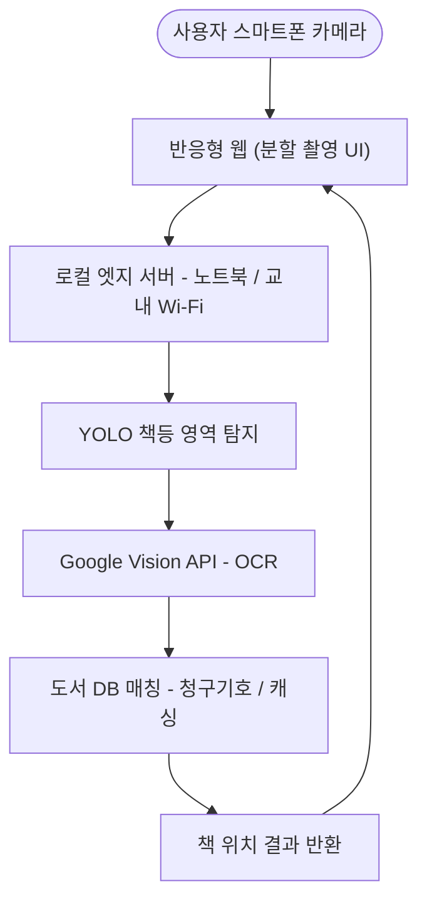

# AI 도서관 서가 탐색

Smart Pinpoint Identification & Navigation Engine

## 목차

- [소개](#소개)
- [핵심 목표](#핵심-목표)
- [시스템 아키텍처](#시스템-아키텍처)
- [기술 스택](#기술-스택)
- [프로젝트 구조](#프로젝트-구조)
- [팀원 및 역할](#팀원-및-역할)
- [진행 상황](#진행-상황)
- [향후 계획](#향후-계획)
- [기대 효과](#기대-효과)
- [License](#license)

## 소개

도서관에서 원하는 책을 찾기 위해 서가 앞을 서성였던 경험은 누구에게나 있습니다. **AI 도서관 서가 탐색**은 이러한 도서관 이용의 장벽을 낮추기 위해 기획된 프로젝트로, 스마트폰 카메라로 서가를 촬영하기만 하면 AI가 찾는 책의 위치를 정확히 짚어주는 웹 서비스입니다.

별도의 고가 장비 없이 학교에 이미 구축된 Wi-Fi, 학생들의 스마트 기기, 그리고 로컬 서버 역할을 할 노트북만으로 탐색 기능을 구현하여 접근성과 효율성을 동시에 극대화하는 것을 핵심 가치로 삼고 있습니다.

## 핵심 목표

프로젝트는 기술 구현과 사용자 경험 두 축에서 다음과 같은 세부 목표를 세우고 진행됩니다.

### 기술적 목표

- 앱 설치 없이 접근 가능한 반응형 웹 환경 구축
- 촬영부터 결과 출력까지 3초 이내 처리
- 책등 탐지율 90% 이상 달성
- 텍스트(OCR) 인식률 85% 이상 달성

### 사용자 경험 목표

- 도서관의 좁은 통로 제약을 극복하기 위한 분할 촬영 UI 및 초광각 렌즈 기술 도입
- 누구나 쉽게 사용할 수 있는 직관적인 인터페이스 제공

## 시스템 아키텍처

가장 큰 특징은 교내 Wi-Fi와 노트북을 활용한 엣지 컴퓨팅 기반 로컬 서버입니다. 이를 통해 데이터를 근실시간으로 처리하며, 경량화된 객체 인식 모델인 YOLO로 책등 영역만 빠르게 분리한 뒤 상용 OCR 기술인 Google Vision API를 결합하여 한국어 텍스트 인식의 정확도와 속도를 동시에 확보했습니다.



## 기술 스택

| 구분 | 사용 기술 |
| --- | --- |
| Frontend | 반응형 웹 (앱 설치 불필요), 스마트폰 카메라 제어 |
| Backend / AI | Python, YOLO(책등 객체 인식), Google Vision API(OCR) |
| 서버 인프라 | 노트북 기반 로컬 엣지 서버, 교내 Wi-Fi |
| 데이터베이스 | 도서 목록 DB, 캐싱 알고리즘 |
| 배포 / 설정 | Firebase (firebase.json, firebase.js 기반 구성) |

## 프로젝트 구조

```txt
CVCLSIMMS/
├── .firebaserc
├── .gitignore
├── firebase.js
├── firebase.json
├── LICENSE
│
├── .firebase
│     └── hosting.cHVibGlj.cache
│
└── public
      ├── app
      │     ├── config.py
      │     ├── main.py
      │     ├── schemas.py
      │     ├── __init__.py
      │     │
      │     ├── data
      │     │     └── book_list.csv
      │     │
      │     ├── routers
      │     │     ├── books.py
      │     │     └── scan.py
      │     │
      │     ├── scans
      │     │     └── tempfile
      │     │
      │     ├── services
      │     │     ├── book_service.py
      │     │     ├── library_api_service.py
      │     │     └── scan_service.py
      │     │
      │     └── static
      │           ├── 404.html
      │           ├── asdfgh.js
      │           ├── index.html
      │           ├── script.js
      │           └── style.css
      │
      ├── models
      │     └── directory_for_yolo
      │
      └─scans
```
<!-- 
## 시작하기

### 요구 사항

- Node.js
- Python 3.x (YOLO / OCR 연동용)
- [Firebase CLI](https://firebase.google.com/docs/cli)
- Google Cloud Vision API 키

### 설치

```bash
git clone https://github.com/dltmdals0623/CVCLSIMMS.git
cd CVCLSIMMS

npm install
```

### Firebase 프로젝트 연결

```bash
npm install -g firebase-tools
firebase login
firebase use --add

### 로컬 실행

```bash
firebase emulators:start
``` -->

## 팀원 및 역할

| 이름 | 역할 | 담당 업무 |
| --- | --- | --- |
| 김지한 | 백엔드 및 AI 엔지니어 | 파이썬 개발 환경 구축, YOLO 책등 인식 알고리즘, OCR 연동 |
| 이승민 | 웹 개발 | 반응형 웹 개발, 도서 DB 기반 캐싱 알고리즘, 스마트폰 카메라 제어 |
| 손영준 | 데이터 / QA | 도서 목록 DB 구축, 현장 촬영 데이터셋 구축, QA |
| 박경찬 | UI / UX 기획 | 분할 촬영 가이드라인, 도서 위치 하이라이트, 웹 UI 디자인 |

## 진행 상황

지난 4월부터 파이썬 개발 환경 세팅, 데이터 수집 등 기초 환경 구축을 완료했으며, 현재는 객체 인식과 API 연동 등 핵심 모듈 개발 단계에 진입해 있습니다.

- 로컬 서버 세팅 및 YOLO 초기 테스트 완료
- 반응형 웹 환경 기초 구축 완료
- 도서 목록 DB 구축 상당 부분 진행
- 전반적인 웹 UI 디자인 진행 중

## 향후 계획

| 시기 | 목표 |
| --- | --- |
| 7월 | 캐싱 및 청구기호 매칭 로직 개발 완료 |
| 8월 | 프론트엔드-백엔드 모듈 간 통신 통합, 인식 실패 시 예외 처리 구현 |
| 9월 | 교내 도서관 실제 환경 1차 현장 테스트, 다양한 조명·각도에서 인식률 및 지연 시간 측정 및 1차 최적화 |
| 10월 | 수집 데이터 기반 YOLO 모델 파인튜닝, 원근 보정 기술 탐구를 통한 성능·정확도 고도화 |

## 기대 효과

1. 도서관 이용자들에게 전례 없는 스마트한 탐색 경험 제공
2. 학교 도서관 행정 업무 경감
3. 프로젝트를 주도하는 학생들의 실무적인 AI 및 개발 역량 강화

## 패치노트

`1.0.0` - 최초 업로드

`1.0.1` - README.md 파일 생성

`1.1.0` - 검색 시 소분류 추가

`1.2.0` - 파일 구조 재정리

## License

이 프로젝트는 [MIT License](./LICENSE)를 따릅니다.
Copyright (c) 2026 dltmdals
