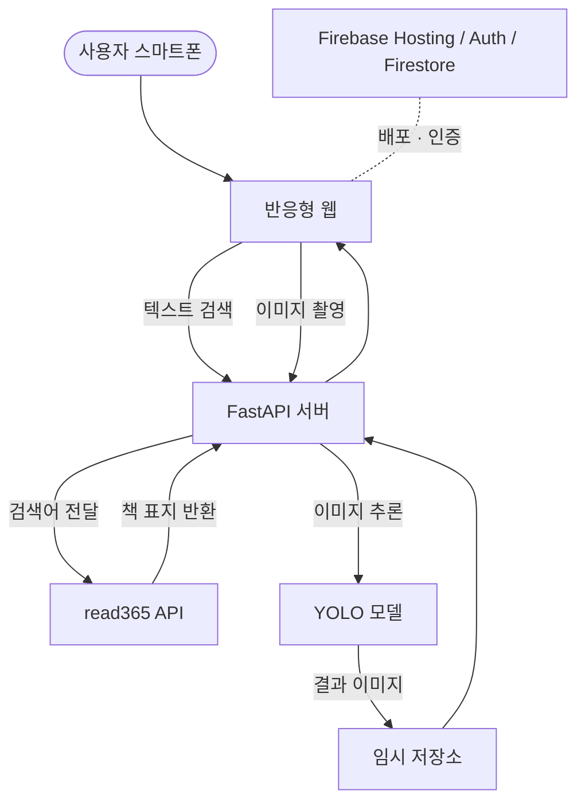

# AI 도서관 서가 탐색

Smart Pinpoint Identification & Navigation Engine

## 목차

- [소개](#소개)
- [핵심 목표](#핵심-목표)
- [시스템 아키텍처](#시스템-아키텍처)
- [기술 스택](#기술-스택)
- [프로젝트 구조](#프로젝트-구조)
- [API 엔드포인트](#api-엔드포인트)
- [시작하기](#시작하기)
- [팀원 및 역할](#팀원-및-역할)
- [진행 상황](#진행-상황)
- [향후 계획](#향후-계획)
- [기대 효과](#기대-효과)
- [패치노트](#패치노트)
- [License](#license)

## 소개

도서관에서 원하는 책을 찾기 위해 서가 앞을 서성였던 경험은 누구에게나 있습니다. **AI 도서관 서가 탐색**은 이러한 도서관 이용의 장벽을 낮추기 위해 기획된 프로젝트로, 스마트폰 카메라로 서가를 촬영하면 AI가 책등을 탐지하고, 학교 도서관 검색 API와 연동해 원하는 책의 정보(청구기호·소장처·대출 상태 등)를 빠르게 확인할 수 있는 웹 서비스입니다.

별도의 고가 장비 없이 FastAPI 기반의 경량 백엔드 서버와 학생들의 스마트 기기만으로 서비스를 구현하여 접근성과 효율성을 동시에 극대화하는 것을 핵심 가치로 삼고 있습니다.

## 핵심 목표

프로젝트는 기술 구현과 사용자 경험 두 축에서 다음과 같은 세부 목표를 세우고 진행됩니다.

### 기술적 목표

- 앱 설치 없이 접근 가능한 반응형 웹 환경 구축
- 학교 도서관(read365/에듀넷) 검색 API와 실시간 연동해 정확한 도서 정보 제공
- YOLO 세그멘테이션 모델을 활용한 책등 영역 탐지
- 촬영부터 결과 출력까지 빠른 응답 속도 확보

### 사용자 경험 목표

- 검색어 입력만으로 십진분류(DDC) 필터링, 정렬, 정확도순 검색이 가능한 UI 제공
- 카메라 촬영 → 즉시 탐지 결과 확인이 가능한 직관적인 플로우 제공
- 누구나 쉽게 사용할 수 있는 모바일 친화적 인터페이스 제공

## 시스템 아키텍처

FastAPI 백엔드 서버 하나가 정적 프론트엔드(`public/`)와 API를 함께 서빙합니다. 텍스트 검색은 학교 도서관 공개 API(read365)를 실시간으로 호출해 결과를 병합·필터링하며, 이미지 검색은 Ultralytics YOLO 세그멘테이션 모델로 책등 영역을 탐지한 뒤 결과 이미지를 반환합니다. 배포/호스팅은 Firebase를 통해 이루어집니다.



> 현재 `/api/scan`은 YOLO로 책등 영역을 탐지해 결과 이미지를 반환하는 단계까지 구현되어 있으며, 탐지된 영역과 도서 DB를 자동으로 매칭하는 기능은 다음 단계로 개발 중입니다.

## 기술 스택

| 구분 | 사용 기술 |
| --- | --- |
| Frontend | 순수 HTML/CSS/JS (반응형, 앱 설치 불필요), 카메라 촬영 UI |
| Backend | FastAPI, Uvicorn |
| AI / 이미지 처리 | Ultralytics YOLO(세그멘테이션 기반 책등 탐지), Pillow |
| 데이터 처리 | pandas (로컬 도서 목록 CSV 파싱), httpx (외부 API 비동기 호출) |
| 외부 연동 | read365(에듀넷 학교도서관) 검색/상태 조회 API |
| 배포 / 인증 | Firebase Hosting, Firebase Auth, Firestore, Firebase Analytics |

## 프로젝트 구조

```txt
CVCLSIMMS/
├── .firebaserc
├── .gitignore
├── firebase.js
├── firebase.json
├── LICENSE
├── README.md
│
├── app/
│    ├── __init__.py
│    ├── config.py            # 경로 및 학교 도서관 API 설정값
│    ├── main.py               # FastAPI 앱 엔트리포인트 (라우터/정적 파일 마운트)
│    ├── requirements.txt
│    ├── schemas.py            # Pydantic 응답 모델 정의
│    │
│    ├── data/
│    │    └── directory_for_booklist   # 로컬 도서 목록 CSV(book_list.csv) 위치
│    │
│    ├── models/
│    │    └── directory_for_yolo       # YOLO 가중치 파일(yolo26m-seg.pt) 위치
│    │
│    ├── routers/
│    │    ├── books.py         # /api/books - 도서 검색
│    │    └── scan.py          # /api/scan  - 이미지 업로드 및 탐지
│    │
│    ├── scans/
│    │    └── directory_for_scanimage  # 탐지 결과 이미지 임시 저장 위치
│    │
│    └── services/
│         ├── book_service.py          # 로컬 CSV 기반 검색
│         ├── library_api_service.py   # read365 외부 API 연동
│         └── scan_service.py          # YOLO 추론 및 결과 이미지 저장
│
└── public/
     ├── 404.html
     ├── index.html
     ├── script.js
     └── style.css
```

## API 엔드포인트

| Method | Endpoint | 설명 |
| --- | --- | --- |
| GET | `/api/books` | `q`(검색어), `ddc`(분류기호, 선택)로 read365 외부 API를 실시간 검색 |
| GET | `/api/books/all` | 로컬 CSV(`book_list.csv`) 전체를 JSON으로 반환 |
| POST | `/api/scan` | 이미지 파일(jpeg/png)을 업로드받아 YOLO로 책등 영역 탐지 후 결과 이미지 URL 반환 |
| GET | `/scans/{filename}` | 탐지 결과 이미지 정적 파일 서빙 |

## 시작하기

### 요구 사항

- Python 3.x
- YOLO 세그멘테이션 가중치 파일 (`app/models/yolo26m-seg.pt`)
- 로컬 도서 목록 CSV (`app/data/book_list.csv`)
- [Firebase CLI](https://firebase.google.com/docs/cli) (배포 시에만 필요)

### 설치 및 로컬 실행

```bash
git clone https://github.com/dltmdals0623/CVCLSIMMS.git
cd CVCLSIMMS

pip install -r app/requirements.txt

uvicorn app.main:app --reload --port 8000
```

서버를 실행하면 `app/main.py`가 `public/` 폴더를 함께 서빙하므로, 별도 프론트엔드 서버 없이 `http://localhost:8000` 접속만으로 웹 화면과 API를 동시에 확인할 수 있습니다.

### Firebase 배포

```bash
npm install -g firebase-tools
firebase login
firebase use --add
firebase deploy --only hosting
```

`firebase deploy --only hosting` 대신 `firebase emulators:start`를 사용하면 로컬에서 실행 할 수 있습니다.

## 팀원 및 역할

| 이름 | 역할 | 담당 업무 |
| --- | --- | --- |
| 김지한 | 백엔드 및 AI 엔지니어 | 파이썬 개발 환경 구축, YOLO 책등 인식 알고리즘, OCR 연동 |
| 이승민 | 웹 개발 | 반응형 웹 개발, 도서 DB 기반 캐싱 알고리즘, 스마트폰 카메라 제어 |
| 손영준 | 데이터 / QA | 도서 목록 DB 구축, 현장 촬영 데이터셋 구축, QA |
| 박경찬 | UI / UX 기획 | 분할 촬영 가이드라인, 도서 위치 하이라이트, 웹 UI 디자인 |

## 진행 상황

- FastAPI 백엔드 서버 구축 및 프론트엔드 정적 서빙 통합 완료
- read365 외부 도서관 API 연동을 통한 실시간 도서 검색, DDC 필터·정렬 기능 구현 완료
- 로컬 CSV 기반 전체 도서 목록 조회 기능 구현 완료
- YOLO 세그멘테이션 모델을 이용한 책등 영역 탐지 기능 구현 완료
- 탐지된 책등 영역과 도서 DB를 매칭하는 로직은 개발 진행 중 (현재는 탐지 결과 이미지만 반환)

## 향후 계획

| 시기 | 목표 |
| --- | --- |
| 7월 | 캐싱 및 청구기호 매칭 로직 개발 완료 |
| 8월 | 프론트엔드-백엔드 모듈 간 통신 통합, 인식 실패 시 예외 처리 구현 |
| 9월 | 교내 도서관 실제 환경 1차 현장 테스트, 다양한 조명·각도에서 인식률 및 지연 시간 측정 및 1차 최적화 |
| 10월 | 수집 데이터 기반 YOLO 모델 파인튜닝, 원근 보정 기술 탐구를 통한 성능·정확도 고도화 |

## 기대 효과

1. 도서관 이용자들에게 전례 없는 스마트한 탐색 경험 제공
2. 학교 도서관 행정 업무 경감
3. 프로젝트를 주도하는 학생들의 실무적인 AI 및 개발 역량 강화

## 패치노트

`1.0.0` - 최초 업로드

`1.0.1` - README.md 파일 생성

`1.1.0` - 검색 시 소분류 추가

`1.2.0` - 파일 구조 재정리

`1.3.0` - 검색 정상화 및 검색 결과 출력 기능 추가

`1.4.0` - 검색 시 필터 및 정렬 구현

`1.5.0` - 정확도 필터 추가 및 출판사 검색 추가

`1.6.0` - FastAPI 백엔드(도서 검색 API, YOLO 이미지 탐지 API) 및 README 구조 반영

## License

이 프로젝트는 [MIT License](./LICENSE)를 따릅니다.
Copyright (c) 2026 dltmdals
